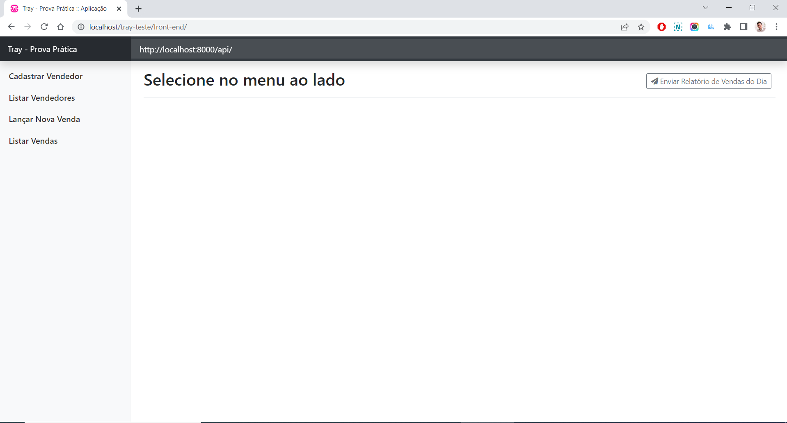
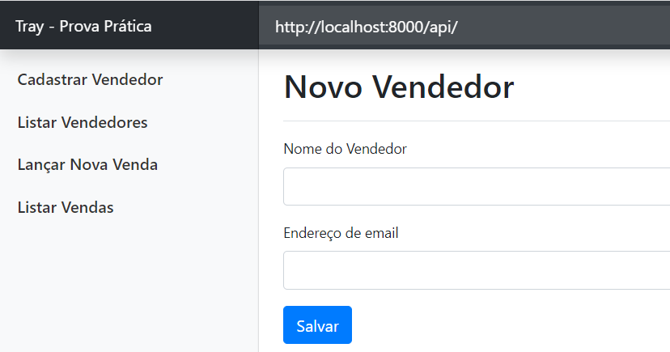
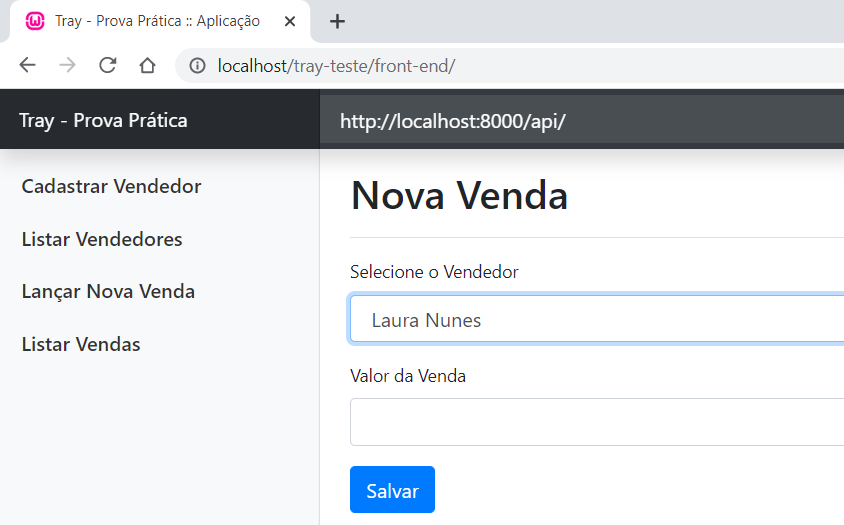
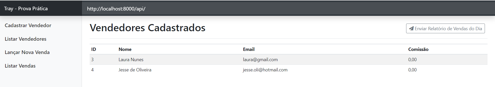

# Tray - Teste
Tray - Prova Prática

## REQUISITOS
- PHP >= 7.3
- Banco de dados MySql ou MariaDB
- Composer Instalado

## HOW TO
- Clonar o projeto "git clone https://github.com/jesseoliveira/tray-teste.git"
- Acessar o diretorio "back-end"
- Executar: composer install
- Editar e configure o arquivo .env
- Executar: php artisan serve
- Acessar o "front-end" pelo navegador

## PAGINA INICICAL

## NOVO VENDEDOR

## NOVA VENDA

## VENDEDORES CADASTRADOS

