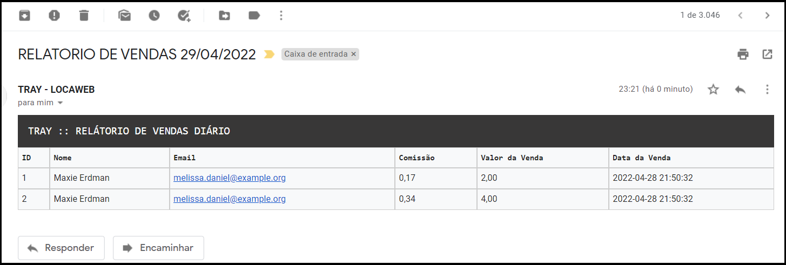

# TRAY - TESTE
Desenvolver uma API para cadastro de vendas para vendedores e calcular a comissão dessas vendas (a comissão será de 8.5% sobre o valor da venda)

## REQUISITOS
- PHP >= 7.3
- Banco de dados MySql ou MariaDB
- Composer Instalado

## HOW TO
- Clonar o projeto "git clone https://github.com/jesseoliveira/tray-teste.git"
- Acessar o diretorio "back-end"
- Editar e configurar o arquivo .env (atenção na parte de email)
- Executar: composer install
- Executar: php artisan migrate
- Executar: php artisan serve
- Acessar o "front-end" pelo navegador

## OBSERVAÇÃO
Para executar os testes, instale o "dusk" com o comando "php artisan dusk:install", depois execute:
- vendor\bin\phpunit
- php artisan dusk

Para uma rotina automatica no envio de email, basta adicionar o comando abaixo ao cron, defindo o melhor horario
- /home/diretorio-back-end-laravel/php artisan send:mail

## PAGINA INICIAL

## NOVO VENDEDOR

## NOVA VENDA

## VENDA CADASTRADA COM SUCESSO

## VENDEDOR CADASTRADO COM SUCESSO

## EMAIL RECEBIDO COM RELATÓRIO DE VENDAS DO DIA
